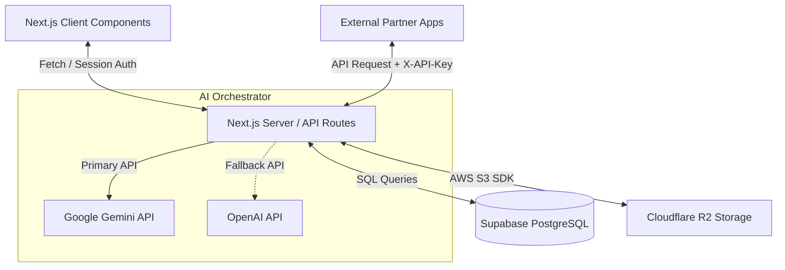
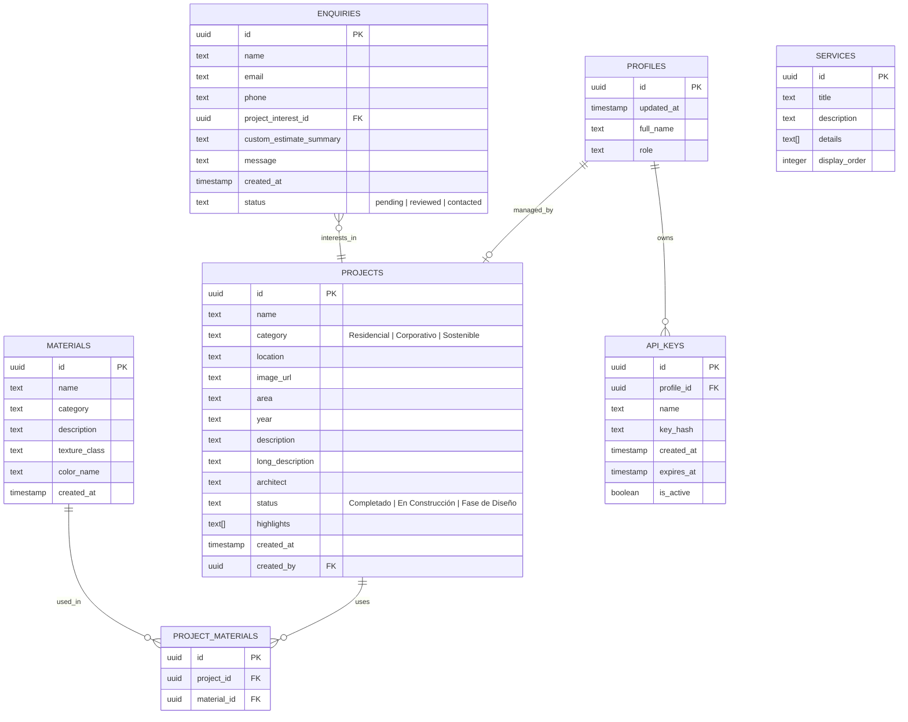
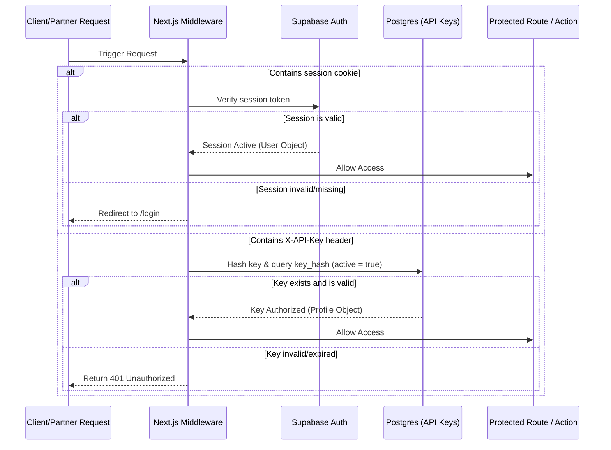
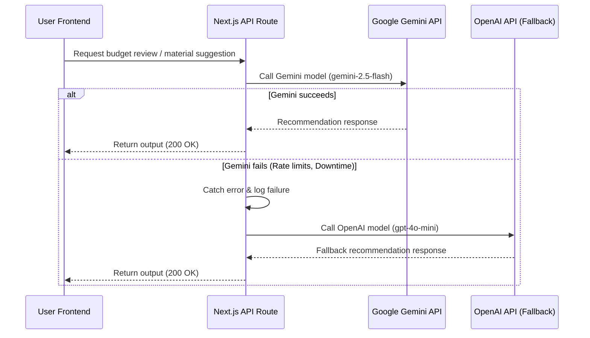

# Production Design Document: AURA Habitats Full-Stack App

This document outlines the system architecture, database schema, security policies, API contracts, and project structure for migrating the **AURA Habitats** portfolio and showroom website into a full-stack production-grade application, incorporating enterprise architectural standards (Dual-auth, Cloudflare R2 Storage, and Multi-provider AI Orchestration).

---

## 1. Architectural Overview

The application will be built using a modern full-stack architecture leveraging **Next.js (App Router)**, **Supabase** (as the relational database), **Cloudflare R2** (for cost-effective, high-performance object storage), and a unified **AI Orchestrator** for intelligent client insights.



### Core Technologies
*   **Frontend & Server Environment:** Next.js (App Router) with TypeScript and Tailwind CSS.
*   **Database:** PostgreSQL (hosted on Supabase) for relational integrity.
*   **Object Storage:** Cloudflare R2 (S3-compatible API) accessed via the AWS S3 SDK.
*   **Authentication:** Combined Middleware supporting session cookie authentication (via Supabase Auth) and Custom Header `x-api-key` validation.
*   **AI Services:** Google Gemini (Primary) and OpenAI (Fallback) for generating custom budget suggestions and design recommendations.

---

## 2. Database Schema (PostgreSQL)

To support the current static features, admin operations, and external developer integrations, the database will consist of the following tables.



### 2.1 Table: `profiles`
Extends Supabase's native `auth.users` for application-specific admin user data.

| Column | Type | Constraints | Description |
| :--- | :--- | :--- | :--- |
| `id` | `uuid` | PK, FK (`auth.users.id` ON DELETE CASCADE) | Unique user identifier matching Supabase Auth. |
| `updated_at` | `timestamp with time zone` | | Timestamp of the last profile update. |
| `full_name` | `text` | NOT NULL | Admin's full name. |
| `role` | `text` | DEFAULT 'editor' | Admin role (e.g., 'super_admin', 'editor'). |

### 2.2 Table: `api_keys`
Stores cryptographically hashed API keys for external developers and integrations.

| Column | Type | Constraints | Description |
| :--- | :--- | :--- | :--- |
| `id` | `uuid` | PK, DEFAULT `gen_random_uuid()` | Unique identifier. |
| `profile_id` | `uuid` | FK (`profiles.id` ON DELETE CASCADE) | Owner of the API Key. |
| `name` | `text` | NOT NULL | Friendly identifier (e.g., "CRM Integration"). |
| `key_hash` | `text` | NOT NULL, UNIQUE | SHA-256 hash of the generated API key. |
| `created_at` | `timestamp with time zone` | DEFAULT `now()` | Generation timestamp. |
| `expires_at` | `timestamp with time zone` | | Optional key expiration date. |
| `is_active` | `boolean` | DEFAULT true | Key status. |

### 2.3 Table: `projects`
Stores luxury architectural projects.

| Column | Type | Constraints | Description |
| :--- | :--- | :--- | :--- |
| `id` | `uuid` | PK, DEFAULT `gen_random_uuid()` | Unique identifier. |
| `name` | `text` | NOT NULL | Project name. |
| `category` | `text` | NOT NULL, CHECK (`category` IN ('Residencial', 'Corporativo', 'Sostenible')) | Category filter. |
| `location` | `text` | NOT NULL | Geographic location. |
| `image_url` | `text` | NOT NULL | Public Cloudflare R2 URL to the header image. |
| `area` | `text` | NOT NULL | Built area (e.g., "520 m²"). |
| `year` | `text` | NOT NULL | Year of completion or launch. |
| `description` | `text` | NOT NULL | Short card description. |
| `long_description` | `text` | NOT NULL | Detailed rich text description for modal. |
| `architect` | `text` | NOT NULL | Lead architect name. |
| `status` | `text` | NOT NULL, CHECK (`status` IN ('Completado', 'En Construcción', 'Fase de Diseño')) | Current phase. |
| `highlights` | `text[]` | DEFAULT '{}' | List of unique features. |
| `created_at` | `timestamp with time zone` | DEFAULT `now()` | Date created. |
| `created_by` | `uuid` | FK (`profiles.id` ON DELETE SET NULL) | Admin who posted the project. |

### 2.4 Table: `materials`
Tactile showroom materials.

| Column | Type | Constraints | Description |
| :--- | :--- | :--- | :--- |
| `id` | `uuid` | PK, DEFAULT `gen_random_uuid()` | Unique identifier. |
| `name` | `text` | NOT NULL | Material name. |
| `category` | `text` | NOT NULL | Material group (e.g., Structural, Cladding, Accent). |
| `description` | `text` | NOT NULL | Detailed tactile experience description. |
| `texture_class` | `text` | NOT NULL | CSS/Tailwind classes representing texture rendering. |
| `color_name` | `text` | NOT NULL | Color palette name. |
| `created_at` | `timestamp with time zone` | DEFAULT `now()` | Date created. |

### 2.5 Table: `enquiries`
Captures contact messages, investment planner details, and quick project inquiries.

| Column | Type | Constraints | Description |
| :--- | :--- | :--- | :--- |
| `id` | `uuid` | PK, DEFAULT `gen_random_uuid()` | Unique enquiry ID. |
| `name` | `text` | NOT NULL | Visitor's name. |
| `email` | `text` | NOT NULL | Visitor's email. |
| `phone` | `text` | | Visitor's phone number. |
| `project_interest_id` | `uuid` | FK (`projects.id` ON DELETE SET NULL) | Linked project of interest. |
| `custom_estimate_summary` | `text` | | Structured text dump from the Investment Planner. |
| `message` | `text` | NOT NULL | Plain message content. |
| `created_at` | `timestamp with time zone` | DEFAULT `now()` | Date submitted. |
| `status` | `text` | DEFAULT 'pending', CHECK (`status` IN ('pending', 'reviewed', 'contacted')) | Pipeline tracker. |

---

## 3. Authentication & Middleware Architecture

The application implements a hybrid authentication middleware protecting all API endpoints under `/api/admin/*` and web paths under `/admin/*`.



### 3.1 Authentication Handlers
*   **Web Panel Auth:** Handled via Supabase session cookie middleware (`@supabase/ssr`).
*   **External Integration API Auth:** Validated by fetching the `x-api-key` header, hashing it via `SHA-256`, and checking its existence and expiration dates inside the `api_keys` database table.

---

## 4. Object Storage Configuration (Cloudflare R2)

All static asset uploads are routed to a **Cloudflare R2** bucket using the AWS S3 SDK Client (`@aws-sdk/client-s3`).

### 4.1 Folder Organization & Lifecycles
*   `/temp/*`: Temporary uploads (e.g. images uploaded during a draft project creation).
    *   **R2 Lifecycle Rule:** Files in `/temp/` are configured to delete automatically after **24 hours**.
*   `/projects/*`: Permanent high-resolution images for projects.
*   `/materials/*`: Permanent material preview images.
*   `/brochures/*`: Dossiers and digital catalogs (PDF format).

### 4.2 Code Integration Example
```typescript
import { S3Client, PutObjectCommand } from "@aws-sdk/client-s3";

const s3 = new S3Client({
  region: "auto",
  endpoint: `https://${process.env.CLOUDFLARE_ACCOUNT_ID}.r2.cloudflarestorage.com`,
  credentials: {
    accessKeyId: process.env.R2_ACCESS_KEY_ID!,
    secretAccessKey: process.env.R2_SECRET_ACCESS_KEY!,
  },
});
```

---

## 5. AI Orchestrator Pattern (Google Gemini & OpenAI Fallback)

To provide automated design feedback and budget optimizations for the **Investment Planner**, we will implement a dual-provider orchestration service.



### 5.1 Service Orchestrator Script (`/src/lib/ai-orchestrator.ts`)
```typescript
import { GoogleGenAI } from "@google/genai";
import OpenAI from "openai";

const ai = new GoogleGenAI({ apiKey: process.env.GEMINI_API_KEY });
const openai = new OpenAI({ apiKey: process.env.OPENAI_API_KEY });

export async function generateDesignReview(prompt: string): Promise<string> {
  try {
    // Primary Provider: Google Gemini
    const response = await ai.models.generateContent({
      model: "gemini-2.5-flash",
      contents: prompt,
    });
    return response.text || "";
  } catch (error) {
    console.error("Gemini failed. Switching to OpenAI fallback...", error);
    
    try {
      // Fallback Provider: OpenAI
      const completion = await openai.chat.completions.create({
        model: "gpt-4o-mini",
        messages: [{ role: "user", content: prompt }],
      });
      return completion.choices[0].message.content || "";
    } catch (fallbackError) {
      console.error("All AI providers failed.", fallbackError);
      throw new Error("Unable to process request at this time.");
    }
  }
}
```

---

## 6. CRUD & API Contracts

### 6.1 Upload File Endpoint
*   **Endpoint:** `POST /api/admin/upload`
*   **Authentication:** Session cookie OR `x-api-key`
*   **Payload (Multipart Form Data):**
    *   `file`: Binary file.
    *   `path`: Target path folder (`temp`, `projects`, or `brochures`).
*   **Response:**
    ```json
    {
      "success": true,
      "url": "https://pub-xxxxxx.r2.dev/projects/file-uuid.webp"
    }
    ```

### 6.2 Enquiries Fetching (API for external CRM)
*   **Endpoint:** `GET /api/admin/enquiries`
*   **Authentication:** `x-api-key`
*   **Response:**
    ```json
    {
      "enquiries": [
        {
          "id": "uuid",
          "name": "John Doe",
          "email": "john@example.com",
          "phone": "+34600000000",
          "custom_estimate_summary": "Estimated Cost: 450,000 EUR...",
          "message": "Interested in Residencias Alura details.",
          "status": "pending",
          "created_at": "2026-06-04T12:00:00Z"
        }
      ]
    }
    ```

---

## 7. Next.js Project Structure

```text
/src
├── app/
│   ├── layout.tsx             # Root layout (fonts, global CSS)
│   ├── page.tsx               # AURA Premium homepage
│   ├── login/
│   │   └── page.tsx           # Admin authentication page
│   ├── admin/
│   │   ├── layout.tsx         # Sidebar shell and admin session check
│   │   └── page.tsx           # Dashboard / Enquiries tracker
│   │   └── projects/
│   │       └── page.tsx       # Projects CRUD interface
│   └── api/
│       ├── admin/
│       │   ├── upload/
│       │   │   └── route.ts   # S3/R2 File uploader handler
│       │   └── enquiries/
				│   │   │   └── route.ts   # Lead queries endpoint (supports x-api-key)
│       └── ai/
│           └── review/
│               └── route.ts   # Budget analysis endpoint (calls orchestrator)
├── components/                # Modular client components
│   ├── Hero.tsx
│   ├── ProjectsSection.tsx
│   ├── MaterialLibrary.tsx
│   ├── InvestmentPlanner.tsx
│   └── ContactForm.tsx
├── lib/
│   ├── ai-orchestrator.ts     # Gemini + OpenAI Fallback controller
│   ├── supabase/
│   │   ├── client.ts          # Client SDK instance
│   │   ├── server.ts          # Server SDK instance
│   │   └── middleware.ts      # Auth validation for /admin and API headers
│   └── utils.ts               # Shared helpers (formatting, class names)
```
